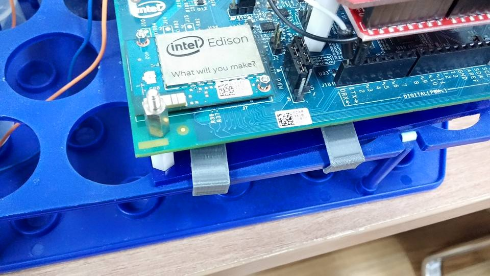

#Litmus BioLabs
<div width="100%" align="center" ></div>
#시스템 소개	

## 1. 총대장균군 검사
<div width="100%" align="center" ></div>
<br>
&nbsp;총대장균군은 사람과 동물의 장 내에서 사는 대장균과 관련된 세균들을 총칭합니다.
대장균군 자체는 그리 병원성이 세진 않지만 토양과 지하수의 분변오염 지표로 사용됩니다.
대장균군의 검출은 다른 병원균 오염의 가능성이 있음을 의미하기도 합니다.
위험한 병원균을 직접 배양하고 검사하는 것 보단 대장균을 통해 검사하는 것이 상대적으로 안전하기도 합니다.

## 2. 기존 검사법
	
&nbsp;여러 검사법이 있지만 효소발색법이 적은 비용과 절차의 간편함으로 인해 많이 사용됩니다.
대장균군은 특별한 효소를 생성하는데 이 효소에 의해 분해되면 색소가 생성되는 물질과 함께 1~2일 동안 배양합니다.
대장균군이 존재해서 물질이 분해되면 물의 색이 변합니다. 대장균군이 없을 경우 색이 변하지 않습니다.

## 3. 새로운 검사 시스템의 개발

&nbsp;값싸고 간단하지만 수작업으로 진행되다 보니 많은 노동력이 필요합니다.
샘플 갯수가 늘어나거나 검사할 수원지가 멀리 떨어져 있거나 넓은 공장에서 검사해야 할 경우에 매우 번거롭습니다.
검사 장소에 설치해 원격에서 자동으로 검사를 하고 데이터를 받아올 수 있는 검사 시스템을 개발하고자 하였습니다.

## 4. 논문 링크
개발된 시스템에 대해 더 자세히 알고 싶으신 분은 Sensor 학술지에 발표한 논문(http://www.mdpi.com/1424-8220/15/5/10569) 을 참고해 주세요.

작동 동영상 또한 준비되어 있습니다. (하단 참조)


#사용법
## 0. App 빌드
1. 아래 명령어를 실행하여 Git Clone을 수행합니다.

	```
	git clone --recursive https://github.com/W5-KAIST/Litmus-BioLabs.git
	```	

2. Intel XDK IoT edition을 실행한 후 [OPEN AN INTEL XDK PROJECT] 버튼을 눌러 App 폴더 아래의 프로젝트 파일을 불러옵니다.

			

3. [BUILD] 탭에서 [Android Build]를 선택한 후, [Upload Project]를 선택하여 빌드 서버에 프로젝트 파일을 업로드합니다.

4. [Build App Now] 버튼을 눌러 빌드가 완료되면, APK 파일을 다운로드하여 스마트폰에 설치합니다.

## 1. 웹캠 스트림 서버 셋업

1. 필요한 패키지들을 설치합니다.
	```
	opkg install git
	opkg install kernel-module-uvcvideo
	```

2. Arduino expansion 보드의 스위치를 USB 허브 방향으로 밀어줍니다.

3. `ls /dev`를 실행하여 `/dev/uvcvideo0`가 존재하는지 확인합니다. uvc 지원이 되는 웹캠이 필요합니다.

4. `git clone https://github.com/drejkim/edi-cam.git`을 실행합니다.

5. `./edi-cam/bin`에 있는 `install_ffmpeg.sh`스크립트를 하여 ffmpeg을 설치합니다.

6. `./edi-cam/web/server`에서 `npm install`을 수행합니다.

7. `./edi-cam/web/client/index.html`에서 `var wsUrl = 'ws://myedison.local:8084/';` 부분의 `myedison`을 hostname으로 수정합니다. (default edison)

8. `node ./edi-cam/web/server/server.js || ./edi-cam/web/client/do_ffmpeg.sh` 를 실행시켜 서버를 작동시킵니다.

	* 에러가 발생할 경우 새로운 세션에서 서버-클라이언트를 별도로 실행시켜 줍니다.

9. 서버가 작동하면 웹 브라우저에서 `http://edisonipaddr:8081080`으로 접속하여 실시간 웹캠 스트림을 받을 수 있습니다.


## 2. WiFi 모드 셋업

1. [Wi-Fi 연결 동영상](https://www.youtube.com/watch?v=6PUfcXDWjFY)을 참조하여 무선공유기에 Edison을 연결합니다.

2. `index.html` 및 `LB_server.py`를 Edison 내부로 다운로드합니다. 

## 3. WiFi 모드 사용법

1. `python LB_server.py`를 실행합니다.

2. App을 켜고 WiFi 모드 탭을 클릭합니다.

3. App의 주소창에 `http://edisonipaddr:8081` 을 입력하고 버튼을 누르면 해당 모터가 작동합니다.

4. 웹 브라우저로 `http://edisonipaddr:8081` 에 접속할 경우 웹 제어 패널 (`index.html`) 이 작동합니다.

## 4. BT 모드 셋업

1. 필요한 패키지들을 설치합니다.  
	```
	opkg install bluez5-dev
	opkg install bluez5-testtools
	``` 

2. `/usr/lib/bluez/test/simple-agent`의 내용 중 `def RequestPinCode(self, device):`의 내용을 아래와 같이 변경합니다.

	```
	def RequestPinCode(self, device):
	print("RequestPinCode (%s)" % (device))
	return "1234"
	```

3. `chmod +x /usr/lib/bluez/test/simple-agent`를 실행합니다.

4. [페어링 동영상](https://www.youtube.com/watch?v=yuTXnxI4UWc)을 참고해서 Edison을 스마트폰과 페어링합니다.

5. `LB_BTserver.py` 를 Edison 내부로 다운로드합니다. 

## 5. BT 모드 사용법

```
python LB_BTserver.py &
rfkill ublock bluetooth
hciconfig hci0 up
hciconfig hci0 piscan
hciconfig hci0 sspmode 0
/usr/lib/bluez/test/simple-agent &
sdptool add --channel=22 SP
rfcomm listen /dev/rfcomm0 22
```

1. 앱을 BT 모드로 바꾸고 Init_BT를 누릅니다. 

2. 주변 장치 검색 목록이 뜨면 Connect 버튼을 클릭합니다.

3. 버튼을 누르면 해당 모터가 작동합니다.

# 플랫폼

* Intel Edison 과 Arduino expansion 보드를 사용하였으며, 추가 Arduino 와 직접 개발한 회로 시스템을 사용했습니다.

* 앱은 Intel XDK IoT Edition을 이용하여 개발되었습니다.

* Android 4.4.2 (kernel 3.4.0) LG G2에서 테스트 되었습니다.

# 3D 프린팅

<div width="75%" align="center" ></div>
<br>
<div width="75%" align="center" ></div>
<br>

&nbsp;3D 프린터를 사용해서 시스템에 필요한 하드웨어 부품을 제작하였습니다.

&nbsp;회로 기판을 프레임에 고정시키기 위한 클램프를 설계하였고 웹캠을 어딘가에 고정하기 편리하도록 웹캠 홀더를 제작하였으며, 두 부품 모두 ABS 필라멘트를 사용해서 프린팅하였습니다. 

&nbsp;제작한 부품의 3D 모델링 파일 (STL) 은 해외 3D 프린팅 용 모델 공유 사이트인 thingiverse에 업로드해서 공유하였습니다. 3D 모델링 파일은 [여기](http://www.thingiverse.com/thing:943783)에서 받으실 수 있습니다.

# 개발예정사항

시스템 전원을 넣은 후 필요한 Setup을 자동화 시키고자 계획중입니다. 표준 식수 대장균 검사법에 맞는 검사량을 처리하고 충분히 긴 시간 동안 독립적으로 작동 가능하도록 시스템 용량을 늘릴 계획입니다.

# [Demo 동영상](https://www.youtube.com/watch?v=id9OeYriV-Y)

